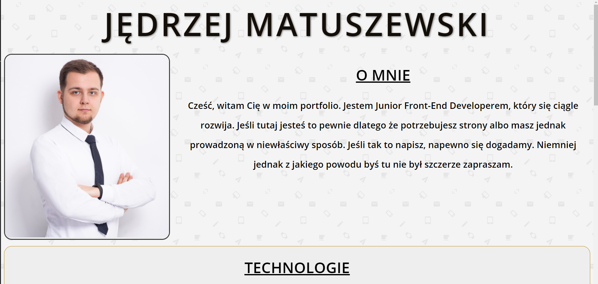
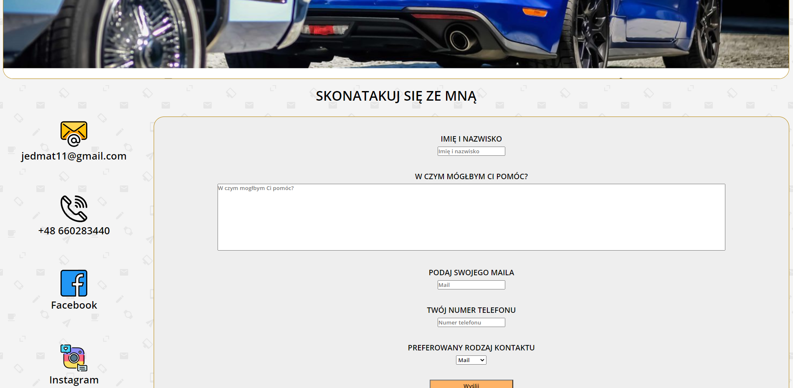
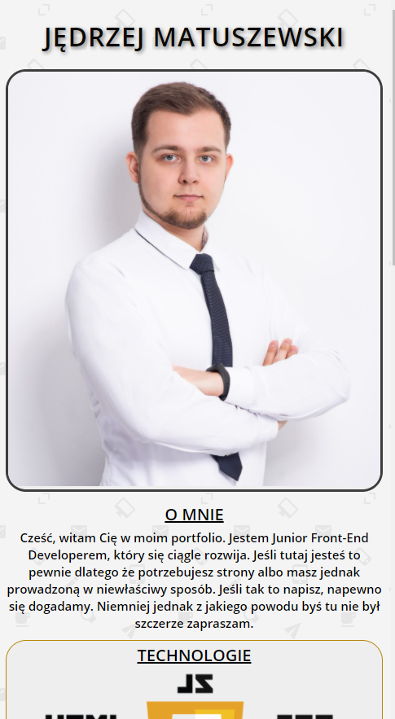

# portfolio

  

   Poniżej możesz zobaczyć moje portfolio wykonane tylko i wyłacznie w HTML i CSS
     
     
    <a href="https://jedrzej-matuszewski.github.io/portfolio/">Zobacz demo</a>
  

## Użyte technologie
- Google Fonts - Strona korzysta z czcionki Open Sans
- Flaticon.com - 4 ikonki potrzebne do kanałów kontaktpwych pochodzą z tej strony
- Animacje z wykorzystaniem @keyframes i pseudoklasy :hover
- Responsive Web Design

## Screenshots

    

  

  

